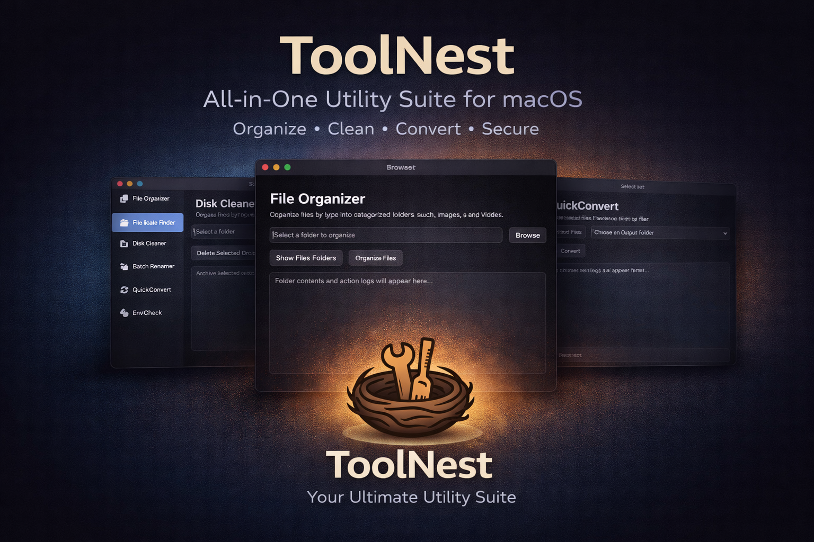
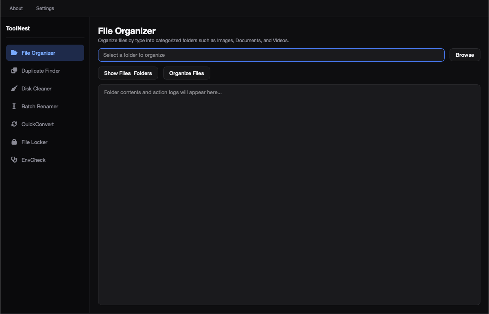
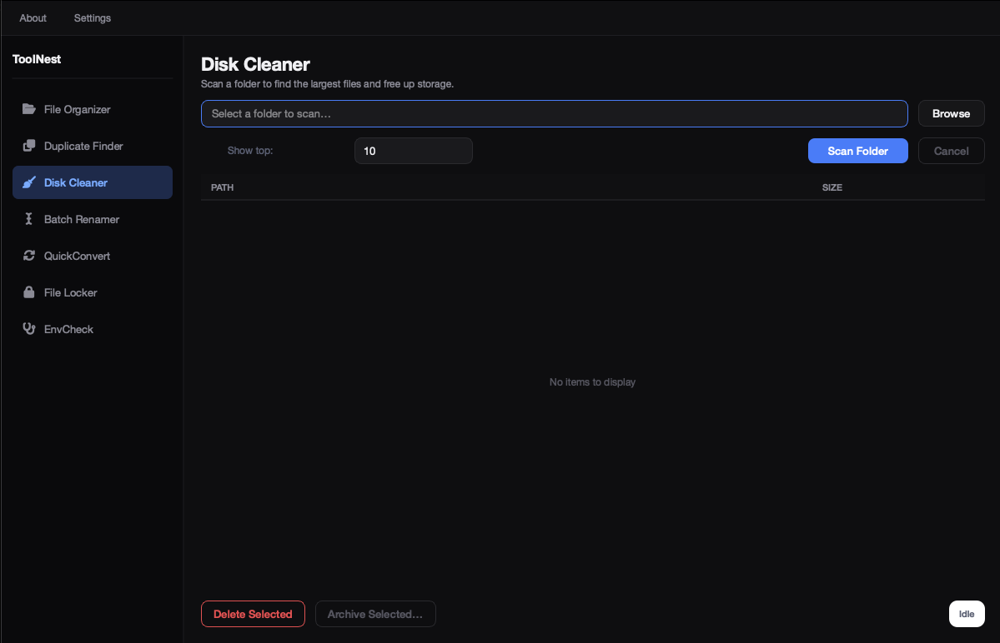
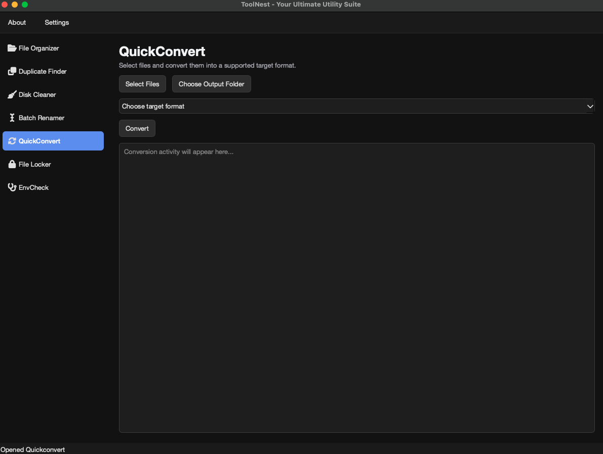
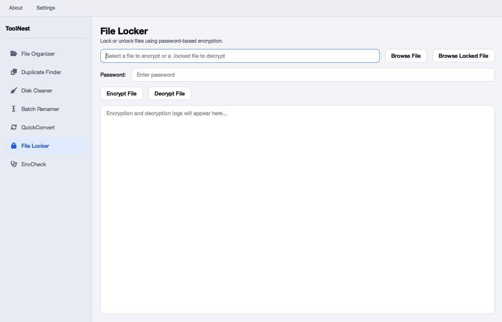

# ToolNest – The Ultimate Utility Suite for macOS

**ToolNest** is a modern, all-in-one desktop application designed to simplify file and system management. It combines powerful utilities into a sleek, intuitive interface—helping you organize, clean, convert, and secure your files with ease.

## ✨ Features
- 📂 **File Organizer** – Automatically organize files by type.
- 🔍 **Duplicate Finder** – Detect and remove duplicate files.
- 🧹 **Disk Cleaner** – Identify large files and free up storage.
- ✏️ **Batch Renamer** – Rename multiple files efficiently.
- 🔄 **QuickConvert** – Convert files between popular formats.
- 🔐 **File Locker** – Encrypt and decrypt sensitive files.
- 🧪 **EnvCheck** – View system specifications and Python environment details.

## 🖼️ Screenshots

## 📦 Download
Download the latest release from itch.io:

👉 **https://siroguz.itch.io/toolnest**

## 🖥️ System Requirements
- macOS 12 (Monterey) or later
- Apple Silicon and Intel supported
- No dependencies required

## 🔒 Privacy
ToolNest runs entirely offline. No data is collected, stored, or transmitted.

## 📜 License
© 2026 Oguz Halavurta. All rights reserved.  
ToolNest is proprietary software and not open source.

## 🚀 Roadmap
- Windows support
- Performance enhancements
- Additional file utilities

## 👨‍💻 Developer
Developed by **Oguz Halavurta**
